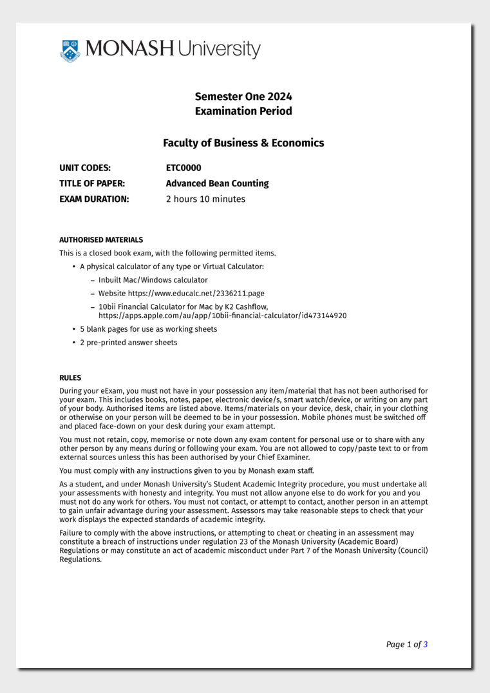

<!-- README.md is generated from README.qmd. Please edit that file -->

# Monash Exam Format Template

This is a Quarto template that assists you in creating an exam for
Monash University.

## Creating a new exam

You can use this as a template to create a exam. To do this, use the
following command:

``` bash
quarto use template quarto-monash/exam
```

This will install the extension and create an example qmd file that you
can use as a starting place for your exam.

## Installation for existing document

You may also use this format with an existing Quarto project or
document. From the quarto project or document directory, run the
following command to install this format:

``` bash
quarto install extension quarto-monash/exam
```

## Example

[](examples/template.pdf)
